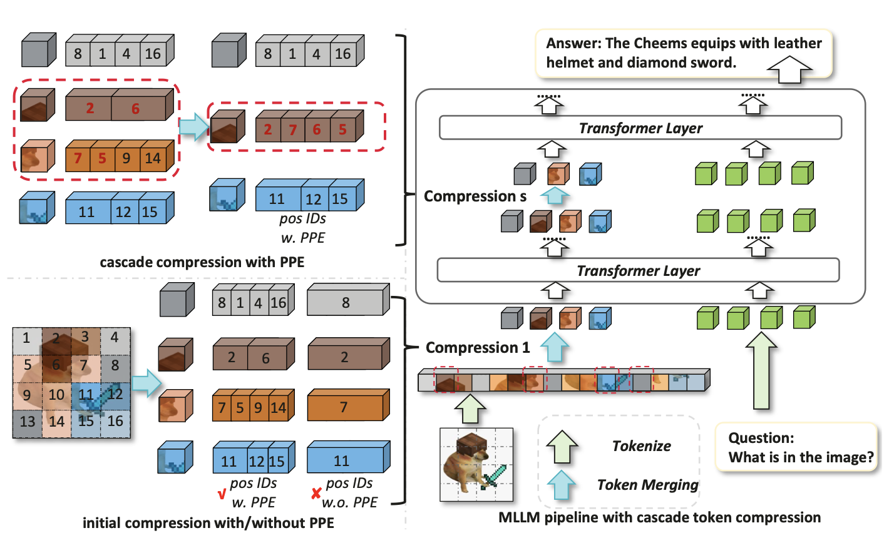

<h1 align="center">
PPE: Positional Preservation Embedding for Token Compression in Multimodal Large Language Models
</h1>
<p align="center">
  <a href="https://arxiv.org/abs/2510.22936">
    
  </a>
  <a href="https://openreview.net/forum?id=OV0AoK7QEr">
    
  </a>
  <a href="https://github.com/MouxiaoHuang/PPE">
    
  </a>
  <a href="https://github.com/MouxiaoHuang/PPE/blob/main/LICENSE">
    
  </a>
</p>
<p align="center">
  
  
</p>


---

## 📑 Table of Contents

- [🌟 Highlights](#-highlights)
- [📦 Installation](#-installation)
- [🚀 Usage](#-usage)
  - [Pretrained Model](#pretrained-model)
  - [📁 Dataset](#-dataset)
  - [🏋️‍♀️ Training](#️️-training)
  - [🧪 Evaluation](#-evaluation)
- [📊 Benchmarks](#-benchmarks)
  - [🖼️ Image Tasks](#️-image-tasks)
  - [🎬 Video Tasks](#-video-tasks)
- [📌 Citation](#-citation)
- [❓ FAQ](#-faq)
- [🤝 Contributing](#-contributing)
- [📬 Contact](#-contact)
- [⚖️ License](#️-license)
- [🙏 Acknowledgements](#-acknowledgements)

## 🌟 Highlights

* **Plug-and-Play & Parameter-Free**: Works in a plug-and-play manner, without modifying original token selection or aggregation mechanisms.
* **Preserve Positional Information**: Preserves richer positional cues under the same reduction ratio.
* **Training-Free & SFT**: Mainly depends on the underlying compression method and can be better when training is allowed.
* **Broad Compatibility**: Easily combines with various token compression methods.
* **Cascade Clustering Support**: Facilitates multi-stage compression within LLM while maintaining performance.

---

## 📦 Installation

### ✅ Requirements

* `transformers` ≥ 4.50 (required for Qwen2.5-VL support)
* `liger_kernel`
* `deepspeed`
* `flash-attn`
* `accelerate==1.1.1`
* `torch_npu` (optional, only needed for Ascend NPU usage)

---

## 🚀 Usage

### Pretrained Model

We conduct experiments primarily on `Qwen2.5-VL-3B-Instruct`. You can download the official pretrained model from [here](https://huggingface.co/Qwen/Qwen2.5-VL-3B-Instruct).

### 📁 Dataset

**Training Data**:

Due to computational limitations, our supervised fine-tuning (SFT) dataset is constructed from public sources:

* [LLaVA-Video-178K](https://huggingface.co/datasets/lmms-lab/LLaVA-Video-178K): 120K sampled instances
* [LLaVA-OneVision](https://huggingface.co/datasets/lmms-lab/LLaVA-OneVision-Data): 300K sampled instances

You may use the whole datasets or customize your own.

Data structure please refer to `./data/demo.json` or [Qwen-VL-Series-Finetune](https://github.com/2U1/Qwen-VL-Series-Finetune) for more information.

**Evaluation Benchmarks**:

* *Image Tasks*: MMBench, SQA, TextVQA, ChartQA, DocVQA, OCRBench
* *Video Tasks*: VideoMME, NeXT-QA, SEED-Bench-Video, MVBench

All benchmarks can be downloaded from their official sources and follow original instructions.
Many original datasets are provided in `.parquet` format. However, we convert most of them into `.json` files with images stored separately (personal preference).

We also provide several example annotation files under `./data/XXX_benchmark` to illustrate the expected data format and directory structure.

**Custom Benchmarks**:

We develop a simple, user-friendly pipeline that ensures inference is fully compatible with the training forward pass. To add a new benchmark, you can follow the implementation of existing ones:

1. Implement the benchmark logic in `./src/evaluate/benchmarks/NEW_BENCH.py`

   ```python
   class CustomDataset(object):
       modality = "image" # or "video"
       
       def __init__(self, image_path="", anno_path="", pre_prompt="", post_prompt=""):
           # Load your annotations here
           self.data = [] 
   
       def __len__(self):
           return len(self.data)
   
       def __getitem__(self, idx):     
           # 1. Prepare common fields
           res = {
               "index": idx,
               "prompt": "Your formatted prompt",
               "GT": "Ground truth answer"
           }
   
           # 2. Add Media: Supports Image (PIL/Path) or Video (Path)
           # For Image Benchmarks:
           res.update({
               "image": image, # Supports PIL.Image object OR image_path
               "image_path": image_path 
           })
   
           # OR For Video Benchmarks:
           # res.update({
           #     "video_path": video_path
           # })
   
           return res
   ```

2. Implement the corresponding evaluation metrics in `./src/evaluate/benchmarks/metrics/eval_NEW_BENCH.py`

3. Update `./src/evaluate/benchmarks/benchmarks_config.py`

---

### 🏋️‍♀️ Training

#### Run Training

* `MODEL_PATH`: path to the pretrained model
* `DATA_ROOT`: root directory of your training data
* `DATA_JSON`: JSON file describing the dataset (examples in `./data/demo.json`)

```bash
bash script/run_sft.sh
# For debugging (single GPU/NPU, no deepspeed, supports breakpoint):
# bash script/run_sft.sh debug
```

---

### 🧪 Evaluation

* `MODEL_PATH`: path to the model checkpoint
* `BENCHMARKS`: list of benchmarks for evaluation
* `PPE_CONFIG`: configuration options for different compression settings
* ⚠️ ***Reminder***: Edit `DATASET_CONFIG` in `./src/evaluate/benchmarks_config.py` according to your local setup.

#### Run Inference

```bash
MODEL_PATH=/path/to/model bash script/run_infer.sh
# For debugging (single GPU/NPU, supports breakpoint):
# bash script/run_infer.sh debug
```

---

## 📊 Benchmarks

### 🖼️ Image Tasks

#### 1. Experiments on Qwen2.5-VL-3B-Instruct

| Qwen2.5-VL-3B-Instruct | Method               | MMBench (EN)             | MMBench (CN)             | SQA*              | TextVQA            | DocVQA             | OCRBench       | ChartQA            | Red. Ratio |
| ---------------------- | -------------------- | ------------------------ | ------------------------ | ----------------- | ------------------ | ------------------ | -------------- | ------------------ | ---------- |
| ***Training-Free***    | **Vanilla (report)** | 79.10                    | 78.10                    | <u>76.14</u>      | <u>79.30</u>       | <u>93.90</u>       | <u>797</u>     | <u>84.00</u>       | 0%         |
|                        | **Chat-UniVi**       | 81.50                    | 80.06                    | 74.35             | 37.60              | 19.58              | 307            | 18.72              | 55%        |
|                        | **Chat-UniVi + PPE** | <u>**82.28 (+0.78)**</u> | <u>**81.43 (+1.37)**</u> | **74.58 (+0.23)** | **73.78 (+36.18)** | **66.16 (+46.58)** | **598 (+291)** | **67.08 (+48.36)** | 55%        |
| ***SFT***              | **Dense**            | <u>85.89</u>             | <u>86.07</u>             | <u>79.39</u>      | <u>79.50</u>       | <u>89.44</u>       | <u>761</u>     | <u>79.96</u>       | 0%         |
|                        | **Chat-UniVi**       | **84.92**                | 83.71                    | 77.48             | 57.66              | 52.48              | 535            | 49.60              | 55%        |
|                        | **Chat-UniVi + PPE** | 84.73 (-0.19)            | **84.87 (+1.16)**        | **78.34 (+0.86)** | **77.14 (+19.48)** | **76.79 (24.31)**  | **691 (+156)** | **74.52 (+24.92)** | 55%        |

*\* denotes reproduction results, as these benchmarks are not reported in the original paper.*

#### 2. Experiments on Qwen2.5-VL-7B-Instruct

We further extended our experiments to the 7B model. However, due to time and resource constraints, we trained it on only 1/5 of the data used for the 3B model.

| ***Qwen2.5-VL-7B-Instruct*** | Method               | MMBench (EN)             | MMBench (CN)        | SQA*              | TextVQA            | DocVQA             | OCRBench       | ChartQA            | Red. Ratio |
| ---------------------------- | -------------------- | ------------------------ | ------------------- | ----------------- | ------------------ | ------------------ | -------------- | ------------------ | ---------- |
| ***Training-Free***          | **Vanilla (report)** | 83.50                    | <u>83.40</u>        | <u>85.52</u>      | <u>84.90</u>       | <u>95.70</u>       | <u>864</u>     | <u>87.30</u>       | 0%         |
|                              | **Chat-UniVi**       | 83.23                    | 80.18               | 80.49             | 35.82              | 27.06              | 479            | 19.92              | 55%        |
|                              | **Chat-UniVi + PPE** | <u>**83.58 (+0.35)**</u> | **82.35 （+2.17）** | **81.59 (+1.10)** | **63.44 (+27.62)** | **66.42 (+39.36)** | **577 (+98)**  | **46.72 (+29.8)**  | 55%        |
| ***SFT***                    | **Dense**            | <u>86.90</u>             | <u>85.35</u>        | <u>84.83</u>      | <u>87.20</u>       | <u>92.97</u>       | <u>826</u>     | <u>86.32</u>       | 0%         |
|                              | **Chat-UniVi**       | 86.23                    | 84.25               | 82.40             | 54.92              | 50.01              | 584            | 43.96              | 55%        |
|                              | **Chat-UniVi + PPE** | **86.26 (+0.03)**        | **84.85 (+0.60)**   | **83.56 (+1.16)** | **82.46 (+27.54)** | **85.84 (+35.83)** | **764 (+180)** | **78.88 (+34.92)** | 55%        |

*\* denotes reproduction results, as these benchmarks are not reported in the original paper.*

### 🎬 Video Tasks	

| Qwen2.5-VL-3B-Instruct | Method               | VideoMME <br />(w/o subs) | VideoMME <br />(w/ subs) | NeXT-QA <br />(MC)       | NeXT-QA<br />(OE)        | SEED-Bench-Video | MVBench           | Avg.                     | Red. Ratio |
| ---------------------- | -------------------- | ------------------------- | ------------------------ | ------------------------ | ------------------------ | ---------------- | ----------------- | ------------------------ | ---------- |
| ***SFT***              | **Dense**            | 57.81                     | 57.96                    | 78.20                    | 31.65                    | <u>57.60</u>     | <u>67.90</u>      | 58.52                    | 0%         |
|                        | **Chat-UniVi**       | 57.22                     | 57.22                    | 77.63                    | 25.37                    | **56.08**        | 66.90             | 56.74                    | 55%        |
|                        | **Chat-UniVi + PPE** | **<u>58.70 (+1.48)</u>**  | **<u>59.07 (+1.85)</u>** | **<u>78.42 (+0.42)</u>** | <u>**32.61 (+7.24)**</u> | 55.98 (-0.10)    | **67.38 (+0.48)** | <u>**58.69 (+1.95)**</u> | 55%        |
|                        | **+ PPE Cascade**    | 58.48                     | 58.52                    | 78.20                    | 32.20                    | 56.11            | 67.35             | 58.48                    | 90%        |

---

## 📌 Citation

If you find this work helpful, please consider citing us:

```bibtex
@article{huang2025ppe,
	title={Positional Preservation Embedding for Multimodal Large Language Models},
  	author={Mouxiao Huang and Borui Jiang and Dehua Zheng and Hailin Hu and Kai Han and Xinghao Chen},
  	journal={arXiv preprint arXiv:2510.22936},
  	year={2025}
}
```

---

## ❓ FAQ

### Q1: Why are some baseline comparisons missing from this repo?

**A:** For convenience, we directly conducted comparisons using official implementations for PACT, ToMe, and VisionZip, etc.

### Q2: Why are some benchmarks missing from this repo?

**A:** Due to internal compliance and the lengthy review process required for exporting code from our corporate environment, some benchmark implementations are currently unavailable. Even though these are based on open-source standards, the export process remains restrictive. However, we have designed the pipeline to be highly extensible. We encourage you to implement your own benchmarks using our straightforward template; it is designed for a seamless, plug-and-play experience.

### Q3: Why is K=8 by default?

**A:** This version adapts to Qwen2.5-VL, which originally uses 3D-MRoPE (`mrope_section=[16, 24, 24]`). K=8 works well for both video and image experiments. For experiments strictly aligned with the paper's image-only results, please manually switch to 2D-MRoPE.

### Q4: What if we set K=32 when using PPE with  `mrope_section=[16, 24, 24]`?

**A:** It falls back to a repeating `[1(T), 1(H), 1(W), ...]` pattern. Since $64$ is not divisible by $3$, it only yields $21$ complete $T/H/W$ triplets, leaving the remainder incomplete. Although not the intended implementation, the performance remains decent because the compressed token still captures multiple position cues rather than just one.

### Q5: Is this the full implementation of the paper?

**A:** No. The currently released code is a cleaned and re-implemented version optimized for readability. Fully migrating and organizing every single experiment involves a significant amount of redundant manual labor. More importantly, the core idea of PPE is elegantly simple and easy to implement: compressed token RoPE embeddings should represent multiple original positions rather than a single point. Our goal is to provide this key insight to the community to foster further discussion and collaborative exploration.

---

## 🤝 Contributing

We welcome contributions from the community! Here's how to get started:

1. Fork this repository
2. Create a new feature branch: `git checkout -b feature/your-feature-name`
3. Make your changes and commit them
4. Push your branch and open a pull request

---

## 📬 Contact

* 💬 For questions, suggestions, or bug reports, please open an issue on GitHub or email us.

---

## ⚖️ License

📄 This project is licensed under the [Apache License 2.0](./LICENSE).

---

## 🙏 Acknowledgements

We build upon the inspiring work of:

* [Qwen-VL-Series-Finetune](https://github.com/2U1/Qwen-VL-Series-Finetune)
* [Chat-UniVi](https://github.com/PKU-YuanGroup/Chat-UniVi)

